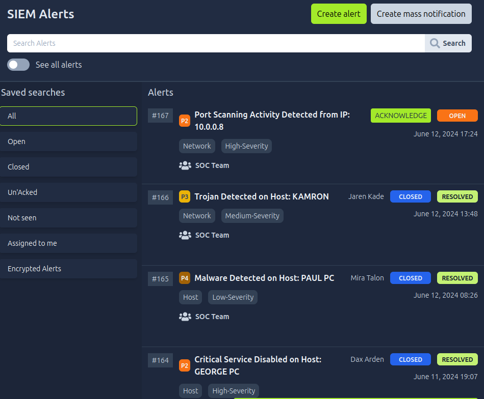
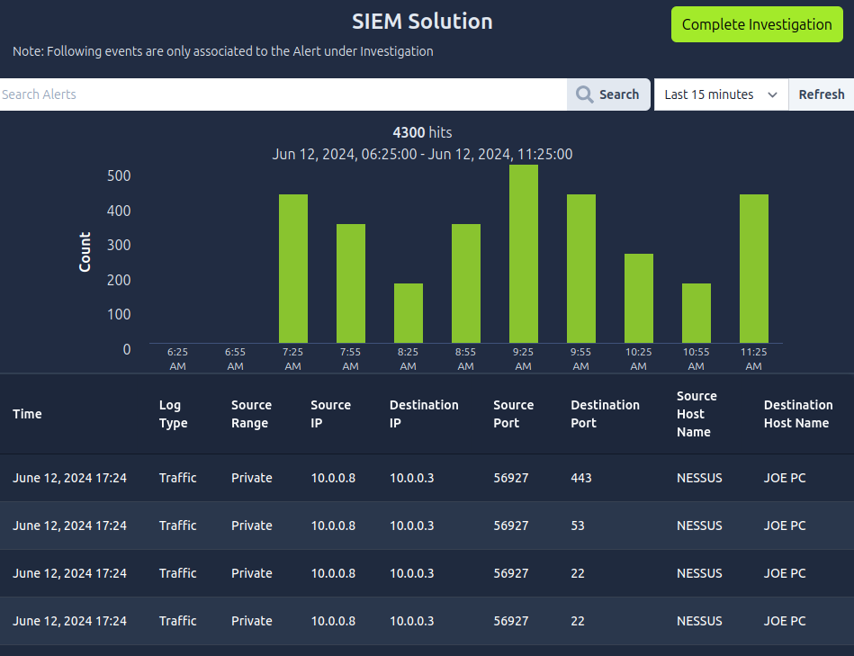

# 🛡️ SOC Analyst Lab: Investigación de Alerta por Escaneo de Puertos

## 📝 Resumen del Escenario
Como Analista SOC de Nivel 1, recibí una alerta de alta prioridad (High-Severity) en la consola del SIEM indicando una posible actividad de escaneo de puertos dentro de la red corporativa. El objetivo de este ejercicio es realizar el triaje inicial, investigar los registros (logs) asociados y determinar si la alerta representa una amenaza real (True Positive) o una actividad benigna (False Positive).

## 🛠️ Herramientas Utilizadas
*   **SIEM (Security Information and Event Management):** Para monitoreo de alertas y correlación de eventos.
*   **Análisis de Logs:** Filtrado e inspección de tráfico de red.

---

## 🔍 Proceso de Investigación (Triaje)

### 1. Detección de la Alerta
Al monitorear el panel principal del SIEM, se identificó la siguiente alerta crítica:
*   **ID de la Alerta:** #167
*   **Severidad:** High-Severity / P2
*   **Descripción:** Port Scanning Activity Detected from IP: 10.0.0.8
*   **Fecha/Hora:** June 12, 2024, 17:24

### 2. Análisis de Registros (Log Analysis)
Para comprender el alcance, procedí a aislar e investigar los eventos específicos asociados a la IP de origen `10.0.0.8` en el visor de eventos del SIEM. 

Se aplicó la metodología de las "5 W" para contextualizar el evento:
*   **¿Cuándo? (When):** La actividad se registró el 12 de Junio de 2024 a las 17:24 horas.
*   **¿Dónde? (Where):** Tráfico interno. La IP de origen `10.0.0.8` estaba intentando conectarse a la IP de destino `10.0.0.3` (Host: JOE PC).
*   **¿Qué? (What):** Se observó un volumen alto de logs de tráfico apuntando a múltiples puertos de destino de manera simultánea, incluyendo los puertos 443 (HTTPS), 53 (DNS) y 22 (SSH). Este comportamiento coincide con la firma típica de un escaneo de red.
*   **¿Quién/Por qué? (Who/Why - El Contexto Clave):** Al revisar los campos detallados de los logs, se descubrió que el "Source Host Name" (Nombre del host de origen) era **NESSUS**.

---

## 💡 Conclusión y Resolución

**Clasificación del Incidente:** Falso Positivo (False Positive).

**Justificación:**
Aunque el comportamiento a nivel de red (múltiples conexiones a diferentes puertos en un corto periodo) es indicativo de un escaneo de puertos, la identificación del host de origen como `NESSUS` cambia completamente el contexto. 

Nessus es una herramienta de escaneo de vulnerabilidades estándar en la industria. Esta actividad no fue originada por un actor de amenazas (Threat Actor), sino que corresponde a una evaluación de vulnerabilidades programada y autorizada dentro de la red corporativa.

**Acción de remediación (Playbook):**
1.  Verificar con el equipo de Auditoría TI / Seguridad si hay un escaneo programado activo para esa fecha y hora.
2.  Al confirmar, cerrar la alerta #167 en el SIEM documentando el evento como un Falso Positivo derivado de una herramienta autorizada.
3.  (Opcional) Ajustar las reglas de correlación del SIEM para ignorar o clasificar con menor severidad los escaneos conocidos provenientes de la IP de Nessus (`10.0.0.8`), reduciendo así la fatiga de alertas para el equipo SOC.
